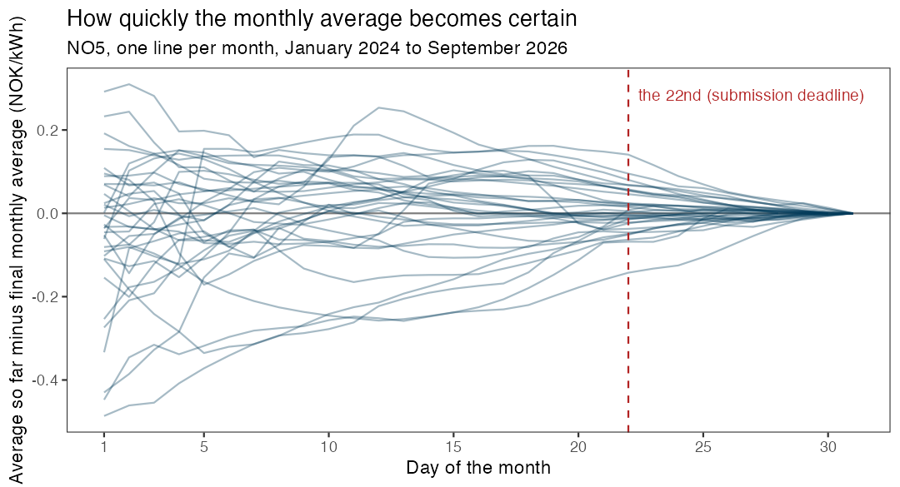

---
format:
  html: default
  pdf:
    papersize: a4
    geometry:
      - margin=3cm
    toc: false
---

## Mandatory assignment: forecasting the electricity price {.unnumbered}

📄 [Print-friendly PDF version](https://raw.githubusercontent.com/holleland/BAN430/master/pdfs/Mandatory_assignment.pdf)

{width="60%"}

You will build a forecasting model for the **daily electricity price** in Western Norway, evaluate it properly, and use it to forecast the rest of **October 2026**, while October is still going on. The same model is then used to say something about the **average price of the whole month**. Everything is allowed as long as you can defend it: the choice of methods is yours. In addition to the report, every group submits an actual forecast, and we compare the forecasts when October is over, as a competition.

|  |  |
|:-----------------------------------|:-----------------------------------|
| **Deadline** | Thursday 22 October 2026 at 12:00 |
| **Groups** | 1 to 3 students |
| **You hand in** | A report with your code, and a forecast submission |
| **What the competition is about** | The daily prices 23 to 31 October in price area NO5 (the main task), and the October average, derived from your daily model |
| **Results** | Presented in the last lecture, Monday 2 November |

The competition is separate from the approval of the assignment. To pass, you need a report that fulfils the requirements below and a valid forecast submission. How well your forecasts do in the competition has no effect on the approval.

### Background

Norwegian households have long enjoyed low electricity prices thanks to the hydro power from the Norwegian waterfalls, but this changed around 2021, and the prices became both higher and much more volatile. In Western Norway (price area *NO5*) the average price in September 2022 was almost 3.6 NOK/kWh (excluding VAT), and the highest daily price was 6.4 NOK/kWh. Just one year later, in September 2023, the monthly average was 1 øre/kWh.

To protect households from the price spikes, the government paid support that was based on the *monthly average* price. Since the monthly average is not known before the month has ended, the consumers did not know at the time of consumption how large the support would be, and forecasts of the monthly average were published in the media. Today, consumers can instead choose a fixed price, *Norgespris*, of 50 øre/kWh, or stay with a contract that follows the spot price. The monthly average price is therefore no longer used to calculate a subsidy, but it is still the natural number to ask for if you want to know whether the spot price or the fixed price will turn out to be the best deal in a given month.

What has not changed is the structure of the problem, which is the reason it makes such a good forecasting exercise. As the month goes by, we observe more and more of the daily prices, and the uncertainty about the monthly average shrinks. The figure shows the difference between the average so far in the month and the final monthly average, for each month since January 2024. At the start of the month, the average so far can be far off. At the deadline of this assignment (the 22nd), it is typically within a few øre/kWh. The remaining uncertainty is about what happens in the last days of the month, so the main job is to forecast those days. The monthly average then follows from your forecasts of the daily prices, together with the days we have already observed.

{width="85%"}

### The task

The **main task** is to build a model for the daily price (NOK/kWh) in price area NO5, and to use it to forecast the daily price for each day from where your data ends until the end of October 2026. The nine days **23 to 31 October** are the ones that are scored. If you submit before the 22nd, the days in between are needed too, but they are not scored.

The second part of the task is to use the same model to say something about the **average price in October 2026** in NO5, defined as the plain average of the 31 daily prices. When you submit, some of the days are already observed, and the rest are forecast by your model. The distribution of the monthly average therefore follows from your daily model: simulate many possible paths for the remaining days of the month, and calculate the average of the full month for each path. You do not build a separate model for the monthly average.

Both parts are **probabilistic**, and for each of the ten targets (the nine days and the monthly average) we ask for two things: a **point forecast**, and 19 **quantiles** of your predictive distribution, the 5%, 10%, 15%, ..., 95% quantiles. The *p*-quantile is the number the outcome falls below with probability *p*, so for example you should expect the outcome to be below your 5% quantile in 5% of the cases, and between your 5% and 95% quantile in 90% of the cases. A forecast with a distribution that is too narrow or too wide will be punished, so how you quantify the uncertainty is as important as the point forecast.

You can submit as many times as you like before the deadline, and the last submission counts. The earlier submissions are not wasted: we will use them to show how much a forecast improves when it is made later in the month, when more information is available.

### The data

The data are the daily electricity prices for the five Norwegian price areas, and are available in the *ban430data* package. The package contains a snapshot, and the function `update_elprices()` downloads the days that have been added since.

```{r}
#| eval: false
install.packages("remotes")
remotes::install_github("holleland/ban430data")   # latest version
```

```{r}
#| eval: false
library(fpp3)
library(ban430data)
elprices <- update_elprices()          # downloads the newest days
no5 <- elprices %>% filter(area == "NO5")
```

Run `update_elprices()` again when you want to add the latest days, it only downloads what is missing. The data frame has one row for each area and day:

| Column | Contents |
|:-----------------------------------|:-----------------------------------|
| `area` | Price area: NO1 (East), NO2 (South), NO3 (Mid), NO4 (North) or NO5 (West) |
| `date` | The date |
| `price` | The daily mean of the hourly spot prices, in NOK/kWh **excluding VAT** |
| `n_hours` | The number of hourly prices that day (24, or 23 and 25 on the days when the clock changes) |

The data start on 1 December 2021. All forecasts must be on the same scale as the `price` column, i.e. excluding VAT. (The prices quoted in the media usually include 25% VAT, except in NO4.) You do not need to convert anything, but remember it if you compare with the 50 øre/kWh of Norgespris.

A few things worth knowing about this data set:

- The prices of tomorrow are published around 13:00 each day. When you make your forecast, you therefore know the price of today and, in the afternoon, also tomorrow. The deadline is at 12:00 on the 22nd, before the prices of the 23rd are published, so nobody knows the first day that is scored when they submit.
- The level of the prices has changed a lot over the period, and the period contains both the energy crisis of 2022 and very low prices in 2023.
- Daily average prices can be negative. This happens in the data (16 days in NO5, between August 2023 and July 2025), so you can not assume that the price is positive.
- Prices are lower in the weekends, and there are holidays.

You are free to use other data as well, for example temperature, other price areas, or fuel and exchange rate data, as long as the data are public and available to you at the time you make the forecast. A series is only useful as a predictor if you will know its value when you forecast, and it is your job to discuss whether that is the case (the ex-ante versus ex-post question from the regression lecture). Weather data can be found in open weather services.

### What to do

Your report must contain the following parts.

**A. Data exploration.** Explore the NO5 series with suitable graphics. Describe trend, seasonality, changes in the level and variance, and unusual observations, and say what you take with you into the modelling.

**B. Benchmarks.** At least two simple benchmark methods, for example a naive forecast, a seasonal naive forecast, or a forecast based on the average of the last days.

**C. Models.** At least two *different* modelling approaches for the daily price, in addition to the benchmarks. Any method is allowed. Examples are exponential smoothing, ARIMA, dynamic regression with predictors, regression with Fourier terms, decomposition-based methods and combinations, and machine learning methods. You decide on any transformation, and you must explain why you chose your methods.

**D. Evaluation.** Decide how you will evaluate and compare your methods while you build them, benchmarks included, and explain your choice. How to do this is part of the exercise: the aim is an honest estimate of how well each method forecasts days it has not seen, so only use information that would have been available at the time of each forecast. Check the calibration of your prediction intervals: how often does the outcome fall inside your 90% interval? Perform residual diagnostics for at least one of your models and discuss what the diagnostics tell you about the assumptions behind your prediction intervals.

**E. Final forecast.** Describe how your final forecasts for the daily prices are produced, and show them in a figure. Then explain how you used the model to derive the distribution of the October average, which includes the days that are already observed.

**F. Discussion.** What are the main limitations of your forecast? What can go wrong in a market where the prices change this much, and how would you handle it in practice? How does the information that arrives during the month change your forecast?

### How the forecasts are scored

The forecasts are scored on what we ask for: the point forecast and the predictive distribution. Lower is better for all the scores.

**Point forecasts.** For the daily prices we use the root mean squared error over the nine days,

$$
\text{RMSE} = \sqrt{\frac{1}{9}\sum_{t=1}^{9}\left(y_t - \hat y_t\right)^2},
$$

where $y_t$ is the actual price and $\hat y_t$ your point forecast. For the October average there is only one value, so we use the absolute error $|y - \hat y|$. Note that the RMSE favours a point forecast close to the *mean* of your predictive distribution, while the *median* minimises the absolute error. You are free to submit different numbers as your point forecast and as your 50% quantile.

**Distributional forecasts.** We use the *Continuous Ranked Probability Score* (CRPS), one of the scores for distributional forecasts in [section 5.9 of the book](https://otexts.com/fpp3/distaccuracy.html). It is built from the *quantile score*. For a quantile forecast $f_{p,t}$ with probability $p$ and the actual outcome $y_t$, the quantile score is

$$
Q_{p,t} = \begin{cases}
2(1-p)\,(f_{p,t} - y_t) & \text{if } y_t < f_{p,t},\\
2p\,(y_t - f_{p,t}) & \text{if } y_t \ge f_{p,t}.
\end{cases}
$$

It can be interpreted like an absolute error: for $p = 0.5$ it is the absolute error of the median, and for other $p$ the error is weighted by how likely it is to be positive or negative. Averaging the quantile scores over all $p$ gives the CRPS, which is a little like a weighted absolute error computed from the entire forecast distribution. We approximate it from your 19 quantiles, $p = 0.05, 0.10, \ldots, 0.95$, by adding up their quantile scores and dividing by 20, which is a numerical approximation of the average over all $p$ between 0 and 1:

$$
\text{CRPS}_t \approx \frac{1}{20}\sum_{p} Q_{p,t}.
$$

For the daily prices we use the average CRPS over the nine days. A narrow distribution is rewarded when it is right, and punished when it is wrong, so the score is minimised when you report your honest uncertainty. The functions are given here, and they can be used when you compare your methods. (If you use the *fable* package, you can also use `accuracy()` with the `RMSE` and `CRPS` measures. The CRPS from `fable` is calculated from the whole distribution, so it is not exactly equal to ours, but it is close.)

<details>

<summary>💡 R functions for the scores</summary>

``` r
# Quantile score (book). f: quantile forecast, y: outcome, p: probability
qscore <- function(f, y, p) ifelse(y < f, 2 * (1 - p) * (f - y), 2 * p * (y - f))

# CRPS from the 19 quantiles q (q05, ..., q95) and the outcome y
crps_q <- function(q, y, p = seq(0.05, 0.95, by = 0.05)) sum(qscore(q, y, p)) / 20

# RMSE of the point forecasts
rmse <- function(point, y) sqrt(mean((y - point)^2))
```

</details>

The competition has four scores, and we will announce a winner for each of them:

|   | Point forecast | Distributional forecast |
|:-----------------------|:-----------------------|:-----------------------|
| **Daily prices** 23 to 31 October | RMSE | CRPS (average over the days) |
| **October average** | Absolute error | CRPS |

The group with the best combined rank in the four categories (the lowest sum of the four ranks) is the overall winner. The scores from your own evaluation of your methods are a useful guide to what you can expect, but remember that a single month is a single outcome, and luck plays a big role in how it goes.

### Submitting your forecast

Your submission is a table with ten rows: one for each of the nine days, and one for the monthly average. The columns are `target`, `point` (your point forecast) and the 19 quantiles `q05`, `q10`, `q15`, ..., `q95`, all in NOK/kWh excluding VAT.

If you have simulated outcomes from your model, the function `forecast_table()` makes the table for you. It takes a matrix with one column for each of the ten targets, and one row for each simulated outcome, and returns the mean of each column as the point forecast, together with the 19 quantiles. Otherwise you can build the table yourself.

```{r}
#| eval: false
# sims: one column per target, one row per simulated outcome.
# Column names: "2026-10-23", ..., "2026-10-31", "month_mean"
fc <- forecast_table(sims)
check_forecast(fc)      # checks that the table has the right format
submit_forecast(fc, group = "Group name", members = "Name 1; Name 2")
```

`check_forecast()` tells you if something is wrong, for example if the quantiles are not increasing, or a target is missing. Choose a group name that you are happy to see in the results. The names of the group members are only used to match your submission to your report. You will get a confirmation when the submission is registered, and you can submit again as many times as you want before the deadline.

All the information you use must be available at the time you submit. Submissions are locked at the deadline, and after it the prices of the last days of October are collected and the forecasts are scored.

### An example: the seasonal naive model

To show how the pieces fit together, here is a complete example with a simple model: the seasonal naive model with a weekly season, where a day is forecast to cost what the same weekday cost last week. It is a benchmark, and **not** a good model, so your job is to do better. The point of the example is the steps around the model, which you can reuse for any model:

1.  get the newest data and fit the model,
2.  simulate many possible paths for the days up to 31 October,
3.  pick out the nine days that are scored, and calculate the October average for each path (the observed days of October plus the simulated ones),
4.  make the table with `forecast_table()`, check it, and submit.

```{r}
#| eval: false
library(fpp3)
library(ban430data)

# 1. The data (NO5, the last year) and the model
elprices <- update_elprices()
no5 <- elprices %>%
  filter(area == "NO5", date >= as.Date("2025-10-01")) %>%
  select(date, price)
fit <- no5 %>% model(snaive = SNAIVE(price ~ lag("week")))

# 2. Simulate 1000 paths up to 31 October (one row per path)
last_day <- max(no5$date)
n_ahead <- as.integer(as.Date("2026-10-31") - last_day)
paths <- fit %>%
  generate(h = n_ahead, times = 1000, bootstrap = TRUE) %>%
  as_tibble() %>%
  select(.rep, date, .sim) %>%
  pivot_wider(names_from = date, values_from = .sim)

# 3. The nine scored days, and the October average of each path
target_days <- as.character(as.Date("2026-10-23") + 0:8)
october <- as.character(as.Date("2026-10-01") + 0:30)
known_sum <- no5 %>%
  filter(as.character(date) %in% october) %>%
  pull(price) %>% sum()
month_mean <- (known_sum + rowSums(select(paths, any_of(october)))) / 31

sims <- paths %>%
  select(all_of(target_days)) %>%
  mutate(month_mean = month_mean)

# 4. The table, the check, and the submission
fc <- forecast_table(sims)
check_forecast(fc)
submit_forecast(fc, group = "Group name", members = "Name 1; Name 2")
```

The simulated paths come from the model, so a better model gives you better paths, and the rest of the code stays the same. If your method does not simulate (for example a model with an exact formula for the distribution), you can build `sims` from random numbers drawn from your predictive distribution, or fill in the table yourself.

### Hand-in and approval

Hand in the report and the code (a Quarto or R Markdown file that reproduces the report) on the course's learning platform before the deadline. Write the names of all group members in the report, and the group name you used for the forecast submission.

The assignment is approved if

- the report contains the parts A to F, and the choices you make are explained and defended,
- the methods are compared with the benchmarks, using an evaluation on past data that you describe and justify, and
- a valid forecast has been submitted before the deadline.

Do not spend time making the report long. A short report with a clear line of thought and good graphics is much better than a long one. The code should be well organised, and it should be possible to run it from the start to the end.

<details>

<summary>💡 Hints: ideas and common mistakes</summary>

- Start simple. A good benchmark is hard to beat for the daily price, so it is a good idea to know how good it is before you build something more advanced.
- Once you have a model for the daily prices, the monthly average comes almost for free, since it is *already partly known* when you forecast it. Simulate many possible paths for the remaining days of the month with your fitted model, and calculate the monthly average of each path (see the `generate()` function in the *fable* package). The quantiles of the simulated averages are your quantiles. The same simulations also give you the quantiles of the daily prices.
- If you transform the price, remember that the intervals from the transformed scale have to be transformed back, and that the price can be negative.
- The forecasts for the days far into the future (more than a week ahead) will mostly reflect the level of the prices, while the next few days depend a lot on the last observations. A model does not have to be equally good at both.
- If your model uses a predictor, think about what the predictor will be. Using the *actual* temperature of the days you forecast gives forecasts that you could not have made at the time.
- Evaluate your methods under the same rules as the competition. The most common mistake is to let information from after the time of the forecast into the model, for example by choosing the model with all data in sight.
- The CRPS punishes a distribution that is too narrow when it misses, and a distribution that is too wide for being uninformative. Check how often the outcome falls between your 5% and 95% quantiles when you evaluate your methods: it should be about 90% of the time.

</details>